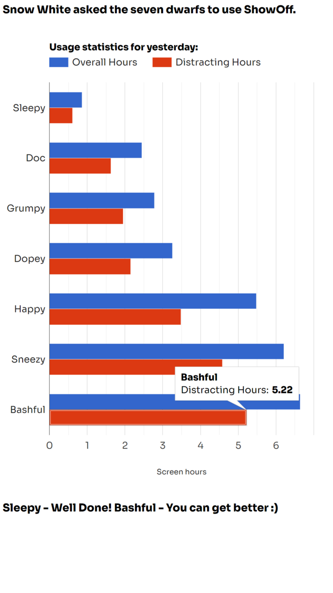
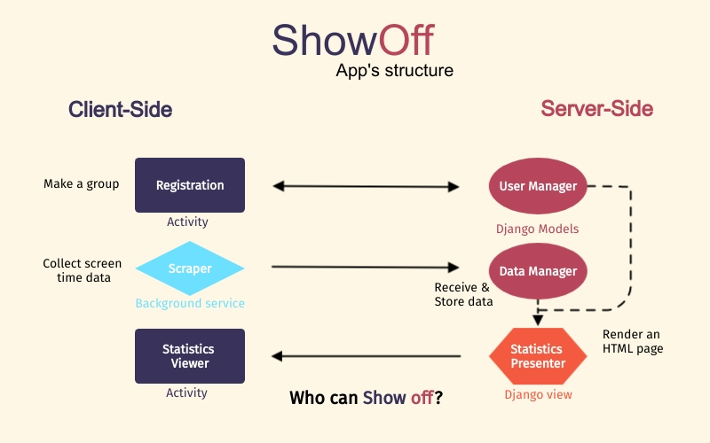

The _ShowOff_ app
=================

The _ShowOff_ app allows you to share your screen time statistics with a group of friends.

Why should you do this?
-----------------------

A mobile screen is often a harmful enemy. It damages your hours of sleep, your health, 
your attention to your closes ones and distracts your mind from the things you want
to do.

There are many screen time tracker apps. Yet, they all have one big vulnerability:
They leave you alone in front of the enemy. What if it is stronger?

Installing _ShowOff_ is an act of humbleness. It might be too optimistic to hope we can beat
the addictive power of our screen using this very screen itself only. Sadly, if no one watching
**us**, we'll keep watching **it**. We have to get better opening conditions.

_ShowOff_ allows you to use the power of a group to reduce your screen time, and invest your 
resources in what care about.

Example
-------
This is how the _ShowOff_ app's statistics viewer looks like:

The "Overall hours" bar measures the overall screentime of the user in the specified period. The "Distracting hours" bar, however, measures only the accumulated usage time of apps defined as distracting, such as Instagram, Twitter, etc.

Structure
---------
Here is a diagram of the app's structure:

The server-side is Django-based, responsible for the user and the data management. It also includes the statistics presenter class, responsible for retrieving the data from the database, processing it, and rendering an HTML page uses the [Google Charts JavaScript library](https://developers.google.com/chart) to present a bars chart as presented above.

The client-side is composed of a considerably simple Android app. The Scraper class is an Android background service responsible for collecting the usage data of the user. The Registration and the statistics Viewer classes are standard Android activities.

Design consideration
--------------------
The main principle of the design is keeping the client-side as "thin" as possible.
The main advantages of delegating most of the responsibilities to the server-side are:
* Simple structure: Fewer classes; No need for client-side Database; less friction between different languages.
* App update is not required when new functionality is applied, or when the UI is changed.
* Accessibility of a variety of powerful technologies

Tasks
-----
The following parts of the project are not yet completed:

Server-side:
* User registration
* Group registration
* Integration of the User and Group Models within the built-in Django's authentication and authorization
* Usage data receiver 

Client-side: 
* Registration
* Scraper
* Statistics Viewer

Features
--------
* Every user can register to ONE group only
* A group has up to 7 members.
* Presentation of the group's screen time statistics for yesterday, the last 7 days, and the last 30 days.

The limits on group size and groups number enhance the tangibility of one's rating in the group. They prop up the personal connections inside the group as well.

Author
------
[Itamar Stahl](https://github.com/itamar-stahl)

Changelog (major changes)
---------

* 31/08/2021 - First publish. Server-side only. Presents fake data.